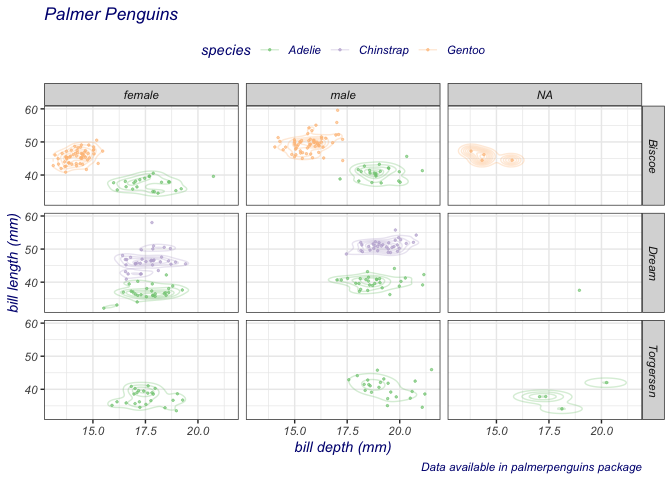

<!-- README.md is generated from README.Rmd. Please edit that file -->
ggformula
=========

[](https://cran.r-project.org/package=ggformula)

Formula interface to ggplot2
----------------------------

`ggformula` introduces a family of graphics functions, `gf_point()`, `gf_density()`, and so on, bring the formula interface to `ggplot()`. This captures and extends the excellent simplicity of the `lattice`-graphics formula interface, while providing the intuitive "add this component" capabilities of `ggplot2`.

Installation
------------

You can install ggformula from github with:

``` r
# install.packages("devtools")
devtools::install_github("ProjectMOSAIC/ggformula")
```

Using ggformula
---------------

The following example illustrates a typical plot constructed with ggformula.

``` r
library(ggformula)
#> Loading required package: ggplot2
#> 
#> New to ggformula?  Try the tutorials: 
#>  learnr::run_tutorial("introduction", package = "ggformula")
#>  learnr::run_tutorial("refining", package = "ggformula")
gf_jitter(Sepal.Length ~ Sepal.Width, data = iris, color = ~ Species,
          width = 0.05, height = 0.05, alpha = 0.6) %>%
  gf_density2d(alpha = 0.3) %>%
  gf_labs(title = "A famous data set",
          caption = "Data available in datasets package",
          ylab = "sepal length",
          xlab = "sepal width"
  ) %>%
  gf_theme(theme_bw()) %>%
  gf_theme(text = element_text(colour = "navy", face = "italic"))
```



### More Information

Find out more about `ggformula` at [projectmosiac.github.io/ggformula](https://projectmosaic.github.io/ggformula).
